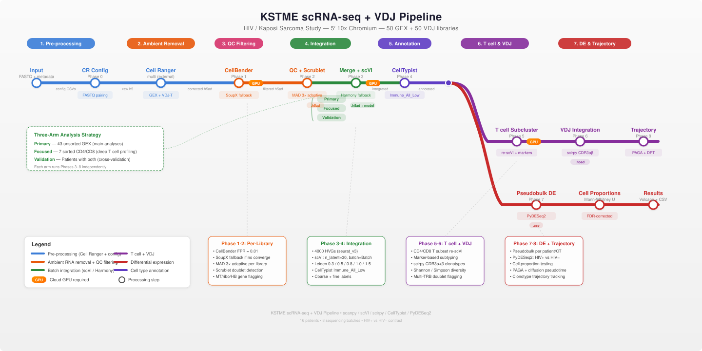

# KSTME scRNA-seq + VDJ Pipeline Workflow

## Overview

End-to-end single-cell RNA sequencing pipeline with T cell receptor (VDJ/TCR) analysis for the KSTME HIV/Kaposi Sarcoma study. Processes 5' 10x Chromium data (50 GEX + 50 VDJ libraries) across 16 patients, 8 sequencing batches, comparing HIV+ vs HIV- individuals.

**Pipeline metro map:**



**Core tools:** scanpy [[1]](#ref1), scVI [[2]](#ref2), scirpy [[3]](#ref3), CellTypist [[4]](#ref4), PyDESeq2 [[5]](#ref5)

---

## Study Design

| Property | Value |
|----------|-------|
| Chemistry | 5' 10x Chromium (SC5P-R2) |
| Libraries | 50 GEX + 50 VDJ |
| Patients | 16 (including 3 non-008 controls) |
| Batches | 8 sequencing flowcells |
| Condition | HIV+ (positive) vs HIV- (negative) |
| Expected cells | ~3,000 per library |
| Tissue types | PBMC, Single Cell Suspension, CD4/CD8 sorted PBMC |

### Three-Arm Analysis Strategy

The dataset contains both unsorted and sorted samples. Integrating CD4-sorted libraries (100% CD4+ T cells) with unsorted PBMCs (~5-15% CD4+) causes alignment artifacts. The pipeline runs three independent analysis arms:

| Arm | Samples | Purpose |
|-----|---------|---------|
| **Primary** | 43 unsorted GEX | All main analyses: integration, DE, clinical correlations, TCR |
| **Focused** | 7 sorted (CD4/CD8) | Deep T cell profiling at high purity |
| **Validation** | Patients 008_216, 008_217, 008_220 | Cross-validate proportions between sorted and unsorted |

### Known Data Issues

| Issue | Resolution |
|-------|------------|
| Missing batch AAAMMK2M5 | Rows skipped; data expected in paired HVFNLDRXX batch |
| Patient 008_252 HIV status | VDJ row mislabeled as "positive"; corrected to "negative" via config override |
| Re-sequenced samples | 008_216_V09, 008_217_scREP_H, 008_217_V09, 008_218_scREP_J appear in both AAAMMK2M5 and HVFNLDRXX |
| Clinical metadata mapping | `008_XXX` patient IDs map to numeric `ptid` (XXX portion) in clinical CSV |

---

## Pipeline Phases

### Phase 0: Cell Ranger Config Generation

**Script:** `pipeline/00_cellranger_multi.py`

Parses the sample metadata CSV, pairs GEX + VDJ libraries by `sampleName`, resolves FASTQ paths across batches, and generates Cell Ranger multi config CSVs.

**Key logic:**
- Groups metadata rows by `sampleName` to pair GEX (`5primeGEX`) and VDJ (`5primeVDJ`) libraries
- Skips rows in the missing `AAAMMK2M5` batch
- Resolves FASTQ directories via three candidate path patterns (standard mkfastq, flat, MAKE_FASTQS_CS)
- Generates one Cell Ranger multi config CSV per sample with `[gene-expression]`, `[vdj]`, and `[libraries]` sections

**Outputs:**
- `output/cellranger/configs/{sample}_config.csv` - per-sample Cell Ranger configs
- `output/cellranger/configs/multi_config.tsv` - master table of all configs

**Verification mode** (`--verify`): Reads Cell Ranger `metrics_summary.csv` and flags samples with <1,000 cells, <500 median genes, or <50% sequencing saturation.

```bash
python pipeline/00_cellranger_multi.py --config pipeline/config.yaml
python pipeline/00_cellranger_multi.py --verify
```

---

### Phase 1: Ambient RNA Removal (CellBender)

**Script:** `pipeline/01_cellbender.py`
**Requires:** Cloud GPU

Removes ambient RNA contamination from raw Cell Ranger matrices using CellBender's VAE approach [[6]](#ref6). Runs per-library (never on merged data). CellBender provides the most precise estimates of background noise levels compared to alternatives such as SoupX [[7]](#ref7) and DecontX [[8]](#ref8).

**Parameters:**
| Parameter | Value | Rationale |
|-----------|-------|-----------|
| `--fpr` | 0.01 | Conservative; protects rare cell types (pDCs, MAIT) |
| `--total-droplets-included` | 20,000 | Enough empty droplets for robust ambient estimation |
| `--epochs` | 150 | Default; increased to 300 via fallback if unconverged |
| `--learning-rate` | 1e-4 | Default |

**Convergence check:** After CellBender completes, validates the output h5ad has a reasonable number of cells. If convergence fails, falls back to a SoupX-like correction (scales raw counts by estimated contamination fraction of 5%).

**Outputs:**
- `output/cellbender/{sample}_cellbender.h5ad`
- `output/cellbender/cellbender_summary.csv`

```bash
python pipeline/01_cellbender.py --config pipeline/config.yaml
python pipeline/01_cellbender.py --sample 008_216_V01 --no-gpu  # single sample, CPU fallback
```

---

### Phase 2: QC Filtering + Doublet Detection

**Script:** `pipeline/02_qc_filtering.py`

Adaptive per-library quality control using MAD (Median Absolute Deviation) thresholds [[9]](#ref9) [[10]](#ref10), plus Scrublet doublet detection [[11]](#ref11).

**QC metrics computed:**
- `total_counts`, `n_genes_by_counts` (cell complexity)
- `pct_counts_mt` (mitochondrial, marks dying cells)
- `pct_counts_ribo` (ribosomal)
- `pct_counts_hb` (hemoglobin, marks RBC contamination)

**Filtering thresholds (MAD-based, per-library):**
| Metric | Direction | Threshold |
|--------|-----------|-----------|
| `log1p(total_counts)` | Both tails | 3 MAD |
| `log1p(n_genes_by_counts)` | Both tails | 3 MAD |
| `pct_counts_mt` | Upper only | 3 MAD |
| `pct_counts_hb` | Upper only | Hard ceiling 5% |

The MAD approach adapts to each library's distribution, correctly handling differences in sequencing depth, tissue type, and processing conditions [[9]](#ref9).

**Doublet detection:** Scrublet with `expected_doublet_rate=0.046` (conservative for ~3K cell loading). Stores continuous `doublet_score` and binary `predicted_doublet` in `.obs`.

**Gene filtering:**
- Remove genes in fewer than 3 cells
- Remove mitochondrial genes from downstream analysis
- Flag (but keep) ribosomal and hemoglobin genes

**Outputs:**
- `output/qc/{sample}_qc.h5ad`
- `output/qc/qc_summary.csv`
- `output/figures/qc/filtering_summary.png`

```bash
python pipeline/02_qc_filtering.py --config pipeline/config.yaml
```

---

### Phase 3: Merge + Batch Integration

**Script:** `pipeline/03_merge_integrate.py`
**Requires:** Cloud GPU (for scVI)

Concatenates per-library data, performs batch-aware HVG selection (seurat_v3 flavor [[12]](#ref12)), and integrates using scVI [[2]](#ref2).

**Steps:**
1. **Load** QC-filtered libraries for the specified arm (primary/focused/validation)
2. **Concatenate** with inner join on genes (keeps only shared genes)
3. **Add metadata**: patientID, Batch, HIVstatus, tissueType, sortingCT, clinical data
4. **Store raw counts** in `adata.layers["counts"]`
5. **Normalize + log-transform** (for visualization and HVG selection only; scVI uses raw counts)
6. **HVG selection**: 4,000 genes, `seurat_v3` flavor, batch-aware (`batch_key="sample_id"`), excluding MT/ribo/HB genes
7. **scVI integration**: Corrects for sequencing batch (`Batch`), regresses out `pct_counts_mt` as continuous covariate
8. **Neighbor graph + clustering**: k=30 neighbors on scVI latent, Leiden [[13]](#ref13) at resolutions [0.3, 0.5, 0.8, 1.0, 1.5]
9. **UMAP** [[14]](#ref14): `min_dist=0.3` for tighter cluster separation

**scVI parameters:**
| Parameter | Value |
|-----------|-------|
| `batch_key` | `Batch` (sequencing batch only) |
| `n_latent` | 30 |
| `n_layers` | 2 |
| `max_epochs` | 400 |
| `early_stopping` | True |
| `continuous_covariates` | `["pct_counts_mt"]` |

**Fallback:** If scVI fails (no GPU, numerical issues), falls back to Harmony [[15]](#ref15) on PCA space.

**Integration quality:** Assessed via scib metrics [[16]](#ref16) (batch ASW, graph connectivity, cell type ASW).

**Outputs:**
- `output/integration/integrated_{arm}.h5ad`
- `output/integration/integration_metrics_{arm}.csv`
- `output/models/scvi_model/` (saved model for Phase 7 scVI DE)
- `output/figures/integration/umap_batch_{arm}.png`

```bash
python pipeline/03_merge_integrate.py --arm primary --config pipeline/config.yaml
python pipeline/03_merge_integrate.py --arm primary --harmony  # Harmony fallback
```

---

### Phase 4: Cell Type Annotation

**Script:** `pipeline/04_cluster_annotate.py`

Automated cell type annotation using CellTypist [[4]](#ref4), with manual validation via canonical marker genes.

**Steps:**
1. **CellTypist**: Run `Immune_All_Low.pkl` (fine-grained) and `Immune_All_High.pkl` (coarse) models with majority voting
2. **Coarse label mapping**: Map fine CellTypist labels to standardized categories via substring matching (longest-match-first to resolve ambiguity)
3. **Marker gene validation**: Wilcoxon rank-sum test per cluster, dot plots of canonical markers
4. **Store annotations**: `cell_type` (coarse) and `cell_subtype` (fine CellTypist label)

**Coarse label categories:**
| Category | CellTypist patterns matched |
|----------|-----------------------------|
| CD4 T | CD4+, Treg, Th1, Th2 |
| CD8 T | CD8+, Cytotoxic |
| T cells | T helper, T cell (generic) |
| NK | NK cells |
| NK/T | NKT |
| B cells | B cells |
| Plasma | Plasma cells |
| Monocytes | Monocyte, Classical, Non-classical |
| DCs | DC1, DC2, cDC |
| pDCs | pDC |

**Canonical markers validated:**
| Cell Type | Markers |
|-----------|---------|
| T cells | CD3D, CD3E |
| CD4 T | CD4, IL7R |
| CD8 T | CD8A, CD8B |
| NK | NKG7, GNLY, KLRD1 |
| B cells | CD19, MS4A1, CD79A |
| Monocytes | CD14, LYZ, FCGR3A |
| DCs | FCER1A, CLEC10A, IRF7 |
| Platelets | PPBP, PF4 |

**Outputs:**
- `output/annotation/annotated_{arm}.h5ad`
- `output/annotation/cluster_markers_{arm}.csv`
- `output/figures/annotation/umap_annotation_{arm}.png`

```bash
python pipeline/04_cluster_annotate.py --arm primary
```

---

### Phase 5: T Cell Subclustering

**Script:** `pipeline/05_tcell_subcluster.py`
**Requires:** Cloud GPU (for scVI)

Deep T cell profiling with lineage-specific subclustering. Re-runs the full integration pipeline on the T cell subset to capture subtle T cell biology that gets lost in the global analysis.

**Why re-cluster:** Genes distinguishing T cells from B cells (CD3E, MS4A1) are not the genes distinguishing naive from exhausted T cells (TCF7, TOX, PDCD1). The T cell subset analysis uses a separate set of 3,000 HVGs and a dedicated scVI model. This subclustering strategy was pioneered by Zheng et al. [[17]](#ref17), who demonstrated that separate re-analysis of tumor-infiltrating T cells revealed 11 distinct T cell subsets with unique functional properties and developmental trajectories that could not be resolved in the global analysis. The approach has since become standard practice for T cell studies, including Yost et al. [[18]](#ref18) who used it to reveal clonal replacement dynamics in anti-PD-1 therapy. Current best practices [[10]](#ref10) recommend this iterative subclustering approach for any cell lineage where fine-grained subtypes are biologically important.

**T cell subtype identification:**

CD8 subtypes:
| Subtype | Key markers |
|---------|-------------|
| Naive | CCR7, SELL, LEF1 |
| Effector | GZMB, PRF1, GNLY |
| Memory | IL7R |
| Exhausted | PDCD1, LAG3, HAVCR2, TOX |
| TPEX | TCF7 + PDCD1 |
| Proliferating | MKI67, TOP2A |

CD4 subtypes:
| Subtype | Key markers |
|---------|-------------|
| Naive | CCR7 |
| Th1 | TBX21, IFNG |
| Th2 | GATA3 |
| Treg | FOXP3, IL2RA |
| Tfh | CXCR5, BCL6 |

**Outputs:**
- `output/tcell/tcell_{arm}.h5ad`
- `output/models/scvi_tcell_model/`
- `output/figures/tcell/tcell_umap_overview.png`

```bash
python pipeline/05_tcell_subcluster.py --arm primary
```

---

### Phase 6: VDJ Integration

**Script:** `pipeline/06_vdj_integration.py`

Integrates TCR clonotype data from Cell Ranger VDJ output into the T cell AnnData using scirpy [[3]](#ref3).

**Steps:**
1. **Load VDJ data**: Read `filtered_contig_annotations.csv` per sample via `scirpy.io.read_10x_vdj`
2. **Merge with GEX**: `scirpy.pp.merge_with_ir` links TCR data to T cell barcodes
3. **Doublet flagging**: Cells with >1 productive TRB chain are flagged as likely doublets (`multi_trb`)
4. **Clonotype definition**: CDR3 amino acid identity (both TRA + TRB chains)
5. **Clonal expansion**: Categories (Singleton, 2x, 3x, 4+) per sample
6. **Diversity metrics**: Shannon and Simpson indices per sample
7. **V gene usage**: Abundance analysis per T cell subtype

**Outputs:**
- `output/vdj/tcell_vdj_{arm}.h5ad`
- `output/vdj/vgene_usage_{arm}.csv`
- `output/figures/vdj/vdj_umap_expansion.png`

```bash
python pipeline/06_vdj_integration.py --arm primary
```

---

### Phase 7: Differential Expression

**Script:** `pipeline/07_differential_expression.py`

Pseudobulk differential expression using PyDESeq2 [[5]](#ref5) (based on the DESeq2 framework [[19]](#ref19)) and cell type proportion testing. The pseudobulk approach avoids the inflated false discovery rates of cell-level DE methods, as demonstrated by Squair et al. [[20]](#ref20).

**Pseudobulk aggregation:**
- Group cells by `patientID` x `cell_type`
- Sum raw counts per group (from `adata.layers["counts"]`)
- Filter: minimum 10 cells and 1,000 total counts per pseudobulk sample
- Each patient contributes one data point per cell type (avoids pseudoreplication)

**DESeq2 per cell type:**
- Design: `~ HIVstatus`
- Contrast: `positive` vs `negative`
- Gene filter: genes with >= 10 total counts
- Results: log2FoldChange, padj (BH correction)
- Significance: padj < 0.05, |log2FC| > 1

**Cell type proportion analysis:**
- Compute per-sample, per-cell-type proportions
- Mann-Whitney U test (HIV+ vs HIV-)
- Benjamini-Hochberg FDR correction

**Optional: scVI-based DE** (complementary approach using the trained scVI model from Phase 3)

**Outputs:**
- `output/differential_expression/de_results_HIV_status_{arm}.csv`
- `output/differential_expression/cell_proportions_HIV_status_{arm}.csv`
- `output/figures/de/volcano_{cell_type}_HIV_status.png`

```bash
python pipeline/07_differential_expression.py --arm primary --contrast HIV_status
python pipeline/07_differential_expression.py --arm primary --scvi-de  # also run scVI DE
```

---

### Phase 8: Trajectory Analysis

**Script:** `pipeline/08_trajectory.py`

Infers T cell differentiation trajectories and tracks clonal evolution along pseudotime.

**Steps:**
1. **PAGA** [[21]](#ref21): Partition-based graph abstraction on T cell subtypes (connectivity analysis)
2. **Diffusion pseudotime** [[22]](#ref22): Diffusion map (15 components) + DPT with root set to the naive T cell cluster
3. **Expansion along pseudotime**: Bins pseudotime and measures clonal expansion fraction per bin
4. **Clonotype trajectory tracking**: For top expanded clonotypes, measures pseudotime span, dominant subtype, and lineage diversity (number of distinct subtypes)

**Outputs:**
- `output/trajectory/trajectory_{arm}.h5ad`
- `output/trajectory/clonotype_trajectories_{arm}.csv`
- `output/figures/trajectory/paga_connectivity.png`
- `output/figures/trajectory/pseudotime_umap.png`
- `output/figures/trajectory/expansion_vs_pseudotime.png`

```bash
python pipeline/08_trajectory.py --arm primary
```

---

## Running the Full Pipeline

### Prerequisites

1. **Conda environment:**
   ```bash
   conda env create -f pipeline/environment.yml
   conda activate scrna_pipeline
   ```

2. **Cloud GPU access** for CellBender (Phase 1), scVI (Phases 3, 5). Estimated ~14 hours total GPU time.

3. **Cell Ranger** installed and accessible (Phase 0 generates configs; Cell Ranger itself runs externally).

### Execution Order

```bash
# Phase 0: Generate Cell Ranger configs
python pipeline/00_cellranger_multi.py

# --- Run Cell Ranger multi externally (Nextflow or manual) ---

# Phase 0: Verify Cell Ranger outputs
python pipeline/00_cellranger_multi.py --verify

# Phase 1: CellBender ambient RNA removal (GPU)
python pipeline/01_cellbender.py

# Phase 2: QC filtering + doublet detection
python pipeline/02_qc_filtering.py

# Phases 3-8: Run per analysis arm
for arm in primary focused validation; do
    python pipeline/03_merge_integrate.py --arm $arm
    python pipeline/04_cluster_annotate.py --arm $arm
    python pipeline/05_tcell_subcluster.py --arm $arm
    python pipeline/06_vdj_integration.py --arm $arm
    python pipeline/07_differential_expression.py --arm $arm
    python pipeline/08_trajectory.py --arm $arm
done
```

### Configuration

All parameters are controlled via `pipeline/config.yaml`. Key sections:

| Section | Controls |
|---------|----------|
| `paths` | Input/output directories |
| `study` | Missing batch handling, HIV overrides, three-arm definition |
| `cellbender` | FPR, epochs, learning rate |
| `qc` | MAD threshold, doublet rate, gene filtering |
| `integration` | HVG count, scVI/Harmony parameters, Leiden resolutions |
| `annotation` | CellTypist models, canonical markers |
| `tcell` | T cell HVG count, subtype markers |
| `vdj` | Clonotype metric, diversity indices |
| `de` | Pseudobulk thresholds, contrast definitions |
| `trajectory` | Diffusion components, root cell type |

---

## Output Directory Structure

```
output/
├── cellranger/                         # Phase 0
│   ├── configs/                        #   Cell Ranger multi config CSVs
│   └── {sample}/outs/                  #   Cell Ranger outputs (external)
├── cellbender/                         # Phase 1
│   ├── {sample}_cellbender.h5ad        #   Corrected matrices
│   └── cellbender_summary.csv
├── qc/                                 # Phase 2
│   ├── {sample}_qc.h5ad               #   QC-filtered per-library
│   └── qc_summary.csv
├── integration/                        # Phase 3
│   ├── integrated_{arm}.h5ad          #   Merged + batch-corrected
│   └── integration_metrics_{arm}.csv
├── annotation/                         # Phase 4
│   ├── annotated_{arm}.h5ad           #   Cell type labels
│   └── cluster_markers_{arm}.csv
├── tcell/                              # Phase 5
│   └── tcell_{arm}.h5ad               #   T cell subset
├── vdj/                                # Phase 6
│   ├── tcell_vdj_{arm}.h5ad           #   T cells + TCR
│   └── vgene_usage_{arm}.csv
├── differential_expression/            # Phase 7
│   ├── de_results_HIV_status_{arm}.csv
│   └── cell_proportions_{arm}.csv
├── trajectory/                         # Phase 8
│   ├── trajectory_{arm}.h5ad
│   └── clonotype_trajectories_{arm}.csv
├── figures/                            # Plots from all phases
│   ├── qc/
│   ├── integration/
│   ├── annotation/
│   ├── tcell/
│   ├── vdj/
│   ├── de/
│   └── trajectory/
├── models/                             # Trained models
│   ├── scvi_model/
│   └── scvi_tcell_model/
└── logs/                               # Per-phase log files
```

---

## AnnData Schema

The central data object passed between phases is an AnnData (`.h5ad`) with the following schema at each stage:

**After Phase 3 (integrated):**
| Slot | Contents |
|------|----------|
| `X` | Normalized, log-transformed expression |
| `layers["counts"]` | Raw integer counts (preserved for DE) |
| `raw` | Full normalized expression (before HVG subsetting) |
| `obs` | sample_id, patientID, Batch, HIVstatus, tissueType, sortingCT, leiden_0.8, doublet_score |
| `var` | highly_variable, mt, ribo, hb flags |
| `obsm["X_scVI"]` | 30D scVI latent representation |
| `obsm["X_umap"]` | 2D UMAP coordinates |

**After Phase 4 (annotated):** adds `cell_type`, `cell_subtype` to `.obs`

**After Phase 6 (VDJ-integrated):** adds `clone_id`, `clonal_expansion`, `IR_VDJ_1_junction_aa`, `multi_trb` to `.obs`

**After Phase 8 (trajectory):** adds `dpt_pseudotime`, `X_diffmap` to `.obsm`

---

## Testing

The pipeline has a comprehensive test suite (127 tests) covering all phases:

```bash
# Run all tests
python -m pytest tests/ -v

# Run tests for a specific phase
python -m pytest tests/test_03_merge_integrate.py -v

# Run real metadata validation (requires data files)
python -m pytest tests/test_real_metadata.py -v
```

| Test file | Tests | Coverage |
|-----------|-------|----------|
| `test_utils.py` | 27 | Config, metadata, QC metrics, MAD outliers |
| `test_00_cellranger_multi.py` | 12 | FASTQ paths, sample tables, config generation |
| `test_01_cellbender.py` | 10 | CellBender commands, convergence, SoupX fallback |
| `test_02_qc_filtering.py` | 7 | MAD filtering, gene filtering |
| `test_03_merge_integrate.py` | 8 | Merge, HVG selection, clustering |
| `test_04_cluster_annotate.py` | 10 | Coarse labels, marker genes |
| `test_05_tcell_subcluster.py` | 7 | T cell subsetting, subtype annotation |
| `test_06_vdj_integration.py` | 4 | Multi-chain doublet flagging |
| `test_07_differential_expression.py` | 7 | Pseudobulk aggregation, cell proportions |
| `test_08_trajectory.py` | 11 | Pseudotime, clonotype trajectories |
| `test_real_metadata.py` | 16 | Real KSTME metadata validation |

---

## Compute Requirements

| Phase | Resource | Estimate |
|-------|----------|----------|
| Cell Ranger multi (50+50) | 250GB RAM, 12 CPU | 2-4 hrs/sample |
| CellBender (50 libraries) | 1 GPU, 16GB VRAM | ~15 min/sample |
| QC + Scrublet (50 libraries) | 16GB RAM, 4 CPU | ~10 min/sample |
| scVI integration | 1 GPU, 32GB RAM | ~30-60 min |
| CellTypist + clustering | 32GB RAM, 8 CPU | ~1 hr |
| T cell scVI | 1 GPU, 16GB RAM | ~30 min |
| VDJ integration | 16GB RAM | ~30 min |
| Pseudobulk DE | 16GB RAM | ~2 hrs |

**Total GPU time:** ~14 hours (CellBender + 2x scVI)

---

## References

Citations retrieved from PubMed. All DOI links point to the original publications.

<a id="ref1"></a>**[1]** Wolf FA, Angerer P, Theis FJ. **SCANPY: large-scale single-cell gene expression data analysis.** *Genome Biology* 19(1):15 (2018). [DOI: 10.1186/s13059-017-1382-0](https://doi.org/10.1186/s13059-017-1382-0)

<a id="ref2"></a>**[2]** Lopez R, Regier J, Cole MB, Jordan MI, Yosef N. **Deep generative modeling for single-cell transcriptomics.** *Nature Methods* 15(12):1053-1058 (2018). [DOI: 10.1038/s41592-018-0229-2](https://doi.org/10.1038/s41592-018-0229-2)

<a id="ref3"></a>**[3]** Sturm G, Szabo T, Fotakis G, Haider M, Rieder D, Trajanoski Z, Finotello F. **Scirpy: a Scanpy extension for analyzing single-cell T-cell receptor-sequencing data.** *Bioinformatics* 36(18):4817-4818 (2020). [DOI: 10.1093/bioinformatics/btaa611](https://doi.org/10.1093/bioinformatics/btaa611)

<a id="ref4"></a>**[4]** Dominguez Conde C, Xu C, Jarvis LB, et al. **Cross-tissue immune cell analysis reveals tissue-specific features in humans.** *Science* 376(6594):eabl5197 (2022). [DOI: 10.1126/science.abl5197](https://doi.org/10.1126/science.abl5197)

<a id="ref5"></a>**[5]** Muzellec B, Telenczuk M, Cabeli V, Andreux M. **PyDESeq2: a python package for bulk RNA-seq differential expression analysis.** *Bioinformatics* 39(9) (2023). [DOI: 10.1093/bioinformatics/btad547](https://doi.org/10.1093/bioinformatics/btad547)

<a id="ref6"></a>**[6]** Fleming SJ, Chaffin MD, Arduini A, et al. **Unsupervised removal of systematic background noise from droplet-based single-cell experiments using CellBender.** *Nature Methods* 20(9):1323-1335 (2023). [DOI: 10.1038/s41592-023-01943-7](https://doi.org/10.1038/s41592-023-01943-7)

<a id="ref7"></a>**[7]** Young MD, Behjati S. **SoupX removes ambient RNA contamination from droplet-based single-cell RNA sequencing data.** *GigaScience* 9(12) (2020). [DOI: 10.1093/gigascience/giaa151](https://doi.org/10.1093/gigascience/giaa151)

<a id="ref8"></a>**[8]** Janssen P, Kliesmete Z, Vieth B, et al. **The effect of background noise and its removal on the analysis of single-cell expression data.** *Genome Biology* 24(1):140 (2023). [DOI: 10.1186/s13059-023-02978-x](https://doi.org/10.1186/s13059-023-02978-x)

<a id="ref9"></a>**[9]** McCarthy DJ, Campbell KR, Lun ATL, Wills QF. **Scater: pre-processing, quality control, normalization and visualization of single-cell RNA-seq data in R.** *Bioinformatics* 33(8):1179-1186 (2017). [DOI: 10.1093/bioinformatics/btw777](https://doi.org/10.1093/bioinformatics/btw777)

<a id="ref10"></a>**[10]** Luecken MD, Theis FJ. **Current best practices in single-cell RNA-seq analysis: a tutorial.** *Molecular Systems Biology* 15(6):e8746 (2019). [DOI: 10.15252/msb.20188746](https://doi.org/10.15252/msb.20188746)

<a id="ref11"></a>**[11]** Wolock SL, Lopez R, Klein AM. **Scrublet: Computational Identification of Cell Doublets in Single-Cell Transcriptomic Data.** *Cell Systems* 8(4):281-291.e9 (2019). [DOI: 10.1016/j.cels.2018.11.005](https://doi.org/10.1016/j.cels.2018.11.005)

<a id="ref12"></a>**[12]** Stuart T, Butler A, Hoffman P, et al. **Comprehensive Integration of Single-Cell Data.** *Cell* 177(7):1888-1902.e21 (2019). [DOI: 10.1016/j.cell.2019.05.031](https://doi.org/10.1016/j.cell.2019.05.031)

<a id="ref13"></a>**[13]** Traag VA, Waltman L, van Eck NJ. **From Louvain to Leiden: guaranteeing well-connected communities.** *Scientific Reports* 9(1):5233 (2019). [DOI: 10.1038/s41598-019-41695-z](https://doi.org/10.1038/s41598-019-41695-z)

<a id="ref14"></a>**[14]** Becht E, McInnes L, Healy J, et al. **Dimensionality reduction for visualizing single-cell data using UMAP.** *Nature Biotechnology* (2018). [DOI: 10.1038/nbt.4314](https://doi.org/10.1038/nbt.4314)

<a id="ref15"></a>**[15]** Korsunsky I, Millard N, Fan J, et al. **Fast, sensitive and accurate integration of single-cell data with Harmony.** *Nature Methods* 16(12):1289-1296 (2019). [DOI: 10.1038/s41592-019-0619-0](https://doi.org/10.1038/s41592-019-0619-0)

<a id="ref16"></a>**[16]** Luecken MD, Buttner M, Chaichoompu K, et al. **Benchmarking atlas-level data integration in single-cell genomics.** *Nature Methods* 19(1):41-50 (2022). [DOI: 10.1038/s41592-021-01336-8](https://doi.org/10.1038/s41592-021-01336-8)

<a id="ref17"></a>**[17]** Zheng C, Zheng L, Yoo JK, et al. **Landscape of Infiltrating T Cells in Liver Cancer Revealed by Single-Cell Sequencing.** *Cell* 169(7):1342-1356.e16 (2017). [DOI: 10.1016/j.cell.2017.05.035](https://doi.org/10.1016/j.cell.2017.05.035)

<a id="ref18"></a>**[18]** Yost KE, Satpathy AT, Wells DK, et al. **Clonal replacement of tumor-specific T cells following PD-1 blockade.** *Nature Medicine* 25(8):1251-1259 (2019). [DOI: 10.1038/s41591-019-0522-3](https://doi.org/10.1038/s41591-019-0522-3)

<a id="ref19"></a>**[19]** Love MI, Huber W, Anders S. **Moderated estimation of fold change and dispersion for RNA-seq data with DESeq2.** *Genome Biology* 15(12):550 (2014). [DOI: 10.1186/s13059-014-0550-8](https://doi.org/10.1186/s13059-014-0550-8)

<a id="ref20"></a>**[20]** Squair JW, Gautier M, Kathe C, et al. **Confronting false discoveries in single-cell differential expression.** *Nature Communications* 12(1):5692 (2021). [DOI: 10.1038/s41467-021-25960-2](https://doi.org/10.1038/s41467-021-25960-2)

<a id="ref21"></a>**[21]** Wolf FA, Hamey FK, Plass M, et al. **PAGA: graph abstraction reconciles clustering with trajectory inference through a topology preserving map of single cells.** *Genome Biology* 20(1):59 (2019). [DOI: 10.1186/s13059-019-1663-x](https://doi.org/10.1186/s13059-019-1663-x)

<a id="ref22"></a>**[22]** Haghverdi L, Buttner M, Wolf FA, Buettner F, Theis FJ. **Diffusion pseudotime robustly reconstructs lineage branching.** *Nature Methods* 13(10):845-8 (2016). [DOI: 10.1038/nmeth.3971](https://doi.org/10.1038/nmeth.3971)
